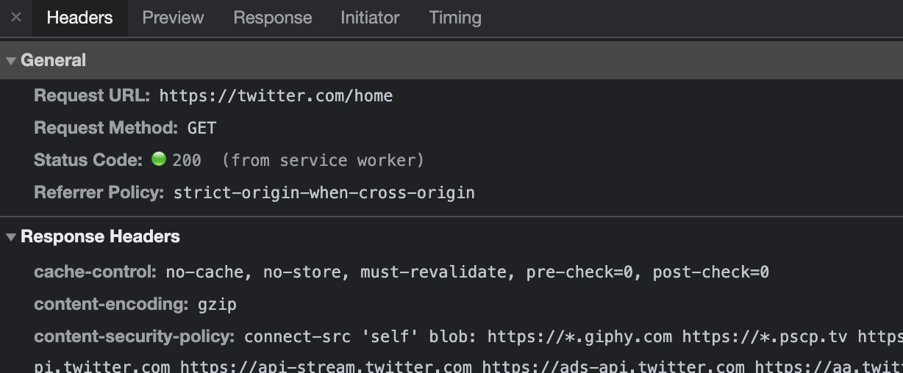
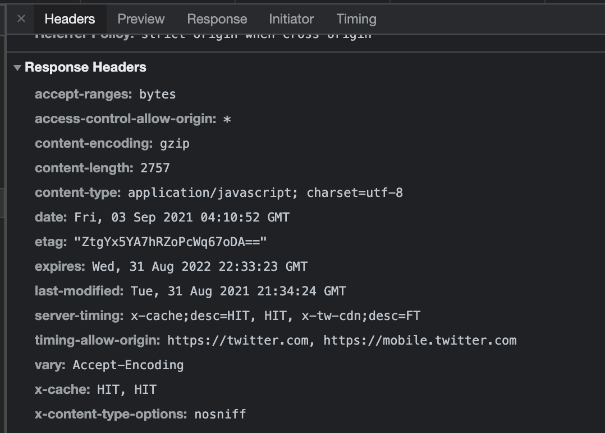
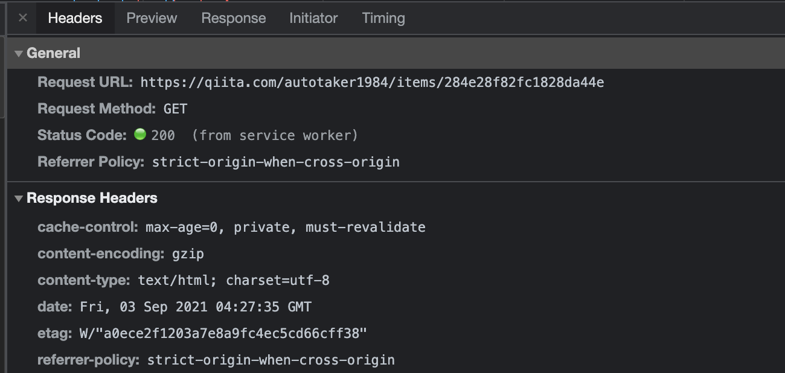
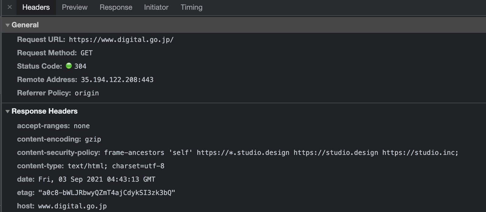
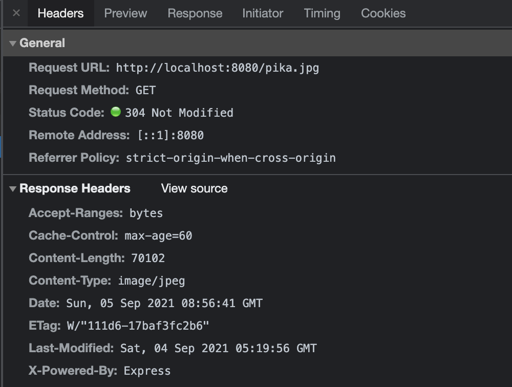
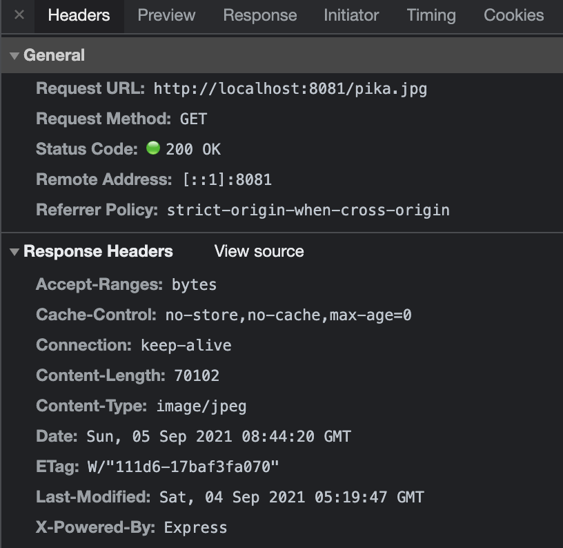

# 課題 1

### 何故キャッシュが必要か

キャッシュ概要: Web サービス・Web サイトで提供されているコンテンツを保存して再利用する仕組み

キャッシュを用いることで、クライアント<=>サーバ間や、サーバ<=>DB 間の通信の速度を改善したり、負荷の解消に役立つ。

(特に大量のアクセスを見込む大規模サービスの場合、キャッシュを適切に使用しなければ全てのアクセスが DB を通ることになりサーバリソースが枯渇する可能性も高まります)

### キャッシュの種類とその説明

代表的なものとして３点挙げます

#### ブラウザキャッシュ

ブラウザがアクセスして取得したコンテンツデータ（画像や HTML など）を保管する仕組み。

#### プロキシキャッシュ

本来の Web サーバーの前にプロキシ用のサーバを置き、そこでリクエストで得られたファイルをキャッシュすることで複数ユーザーに対してキャッシュコンテンツの配信を行う仕組み。

#### サーバー/アプリキャッシュ

DB へのクエリ結果などをアプリケーションが稼働しているサーバー上(ファイルやオンメモリ)にキャッシングさせる仕組み。
Redis 等の各サーバとは独立したインメモリデータストアに保存することで、複数サーバからの参照も可能にすることが可能。

### ブラウザがキャッシュを制御するために存在する HTTP ヘッダー 3 つ以上&役割

#### Cache-Control

HTTP/1.1 で 追加された、キャッシュの「振る舞い」を定義するヘッダー。no-store で「キャッシュの禁止」を指示したり、max-age で相対時間でのキャッシュ有効時間を設定することが可能。

#### Expires

キャッシュの有効期間を定義するヘッダー。(Cache-Control: max-age と同じ)
有効期限は最大約 1 年が推奨される。

#### ETag

ファイルに更新が有るか否かを確認するためのヘッダー。
サーバがこの値を参照することでリソースが更新されているかどうかを判断し、コンテンツデータの再送するか否かを決定する。

(Cache-Control ヘッダーや Expires ヘッダーと同時に配信された場合は、Cache-Control ヘッダーや Expires ヘッダーが優先される)

参考リンク: https://aimstogeek.hatenablog.com/entry/2018/01/17/154537

### ブラウザのキャッシュサイズ上限について・上限到達時の挙動

##### chrome

上限無し？？(起動時のディスク容量の 10%程度？)

参考リンク: https://superuser.com/questions/378991/what-is-chrome-default-cache-size-limit

使用可能キャッシュ領域が全て埋まった場合は、最も過去に使用されたデータが削除され、上限を下回るまで削除を繰り返す(LRU ポリシー)

##### safari

上限は無制限？

参考リンク: https://stackoverflow.com/questions/38218859/whats-the-size-limit-of-cache-storage-for-service-worker

chrome と同様に LRU ポリシーによって最も過去に使用されたデータが削除され、上限を下回るまで削除を繰り返されると思われる(そのものの文献が見つかりませんでした・・)

### 動的なサイトをキャッシュするなら、expires は使わない方が良い理由

動的サイトは頻繁に内容が変わる可能性が高い一方で、
「expires」を使用すると設定した期間を過ぎるまでキャッシュされたコンテンツデータを返してしまうため。

動的サイトのキャッシュをする場合は、If-Modified-Since や ETag を用いることが推奨される。

参考リンク: https://blog.redbox.ne.jp/http-header-tuning.html

### ブラウザのキャッシュが WEB サービスに用いられている実例

- Twitter

  

「cache-control: no-cache, no-store」とあるので html のキャッシュはさせない設定となっている。



js のレスポンスついては etag や last-modified を使用してキャッシュの期限設定を行なっている模様。

(あまり理解できていないですが、親ページ自体はキャッシュしないものの、コンポーネントを管理している JS についてはキャッシュをしているということでしょうか・・？)

- Qiita



`max-age=0`なので、ブラウザキャッシュはさせないが、Etag での最適化がされている。

- デジタル庁



キャッシュ防止の設定は入ってなさそう。

# 課題２（実装）

### 起動

```
yarn install
yarn dev
```

### キャッシュする場合

#### http://localhost:8080/pika.jpg



### キャッシュしない場合

#### http://localhost:8081/pika.jpg



# 課題３

Twitter などの頻繁に更新がなされるサービス動的ページ(タイムラインなど)についてはキャッシュをすべきではないかと思います。
(他あまり思いつかなかったので相談したいです！)

# 課題 4(クイズ)

- last-modified と ETag の両方を指定した際にどちらがより優先されるでしょうか？

- max-age と s-maxage の違いを簡単に説明してください

- max-age が 3600 で設定されているページにアクセスし、その後１時間経過した後に再度同じページにアクセスしました。
  コンテンツに変更がなかったとすると、返る HTTP ステータスコードは何になるでしょうか？
