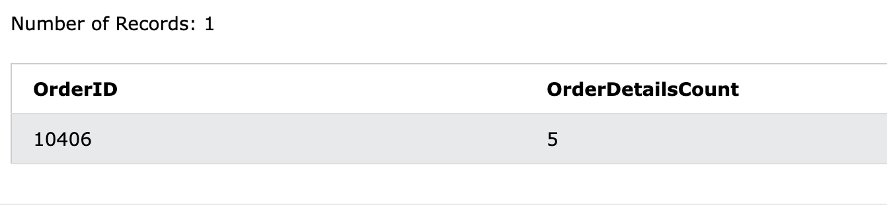

## 課題１

#### 「常連顧客を特定して欲しい」と頼まれました

- 1996 年に 3 回以上注文した（Orders が 3 つ以上紐づいている）Customer の ID と、注文回数を取得する

```sql
SELECT
  CustomerID,
  COUNT(CustomerID) AS OrderCount
FROM
  Orders
WHERE
  Orders.OrderDate LIKE '1996%'
GROUP BY CustomerID
HAVING OrderCount >= 3
ORDER BY OrderCount DESC;
```

- 最もよく注文してくれたのは、どの Customer か


結果より、65,63,20 の Customer が該当

#### 過去最も多くの OrderDetail が紐づいた Order を取得する

```sql
SELECT
  OrderID,
  COUNT(OrderDetailID) AS OrderDetailsCount
FROM
  OrderDetails
GROUP BY OrderID
ORDER BY OrderDetailsCount DESC
LIMIT 1
```



結果より、５件紐づいている

#### 過去最も多くの Order が紐づいた Shipper を特定する

```sql
SELECT
  ShipperID,
  COUNT(OrderID) AS OrderCount
FROM
  Orders
GROUP BY ShipperID
ORDER BY OrderCount DESC;

```


結果より、ID:2 の Shipper が該当

#### 売上が高い順番に Country を並べる

```sql
SELECT
  ROUND(SUM(Products.Price * OrderDetails.Quantity)) AS Sales,
  Customers.Country
FROM OrderDetails
  JOIN Products ON (OrderDetails.ProductID = Products.ProductID)
  JOIN Orders ON (OrderDetails.OrderID = Orders.OrderID)
  JOIN Customers ON (Orders.CustomerID = Customers.CustomerID)
GROUP BY Customers.Country
ORDER BY Sales DESC;
```


結果より、最も売り上げが高いのは USA

#### 国ごとの売上を年毎に（1 月 1 日~12 月 31 日の間隔で）集計する

```sql
SELECT
  Customers.Country,
  strftime('%Y',Orders.OrderDate) as Year,
  ROUND(SUM(OrderDetails.Quantity * Products.Price)) as Salse
FROM Customers
JOIN Orders ON Orders.CustomerID = Customers.CustomerID
JOIN OrderDetails ON OrderDetails.OrderID = Orders.OrderID
JOIN Products ON Products.ProductID = OrderDetails.ProductID
GROUP BY Customers.Country, Year
ORDER BY Customers.Country
```


#### フラグ立て

- Employee テーブルに「Junior（若手）」カラム（boolean）を追加して、若手に分類される Employee レコードの場合は true にする

```sql
ALTER TABLE Employees ADD COLUMN Junior boolean default false;

UPDATE Employees
SET Junior = true
WHERE  strftime('%Y', DATE(BirthDate)) > '1960';
```

#### 多くの運送をしている業者を特定する

- 「long_relation」カラム（boolean）を Shipper テーブルに追加

```sql
ALTER TABLE Shippers ADD long_relation boolean default false;
```

- long_relation が true になるべき Shipper レコードを特定し、更新
  - long_relation の定義：これまでに 70 回以上、Order に関わった Shipper（つまり発注を受けて運搬作業を実施した運送会社）

```sql
UPDATE Shippers
SET long_relation = true
WHERE ShipperID IN  (
SELECT ShipperID FROM Orders
GROUP BY ShipperID
HAVING COUNT(ShipperID)  >= 70
);
```

- それぞれの Employee が最後に担当した Order と、その日付を取得

```sql
SELECT Employees.EmployeeID, Orders.OrderDate AS LatestOrderDate, Orders.OrderID
FROM Orders JOIN Employees ON Orders.EmployeeID = Employees.EmployeeID
GROUP BY Employees.EmployeeID
HAVING MAX(Orders.OrderDate)
```

## NULL の扱いに慣れる

```sql
UPDATE Customers SET CustomerName = NULL WHERE CustomerID < 10
```

- CustomerName が存在するユーザーを取得する

```sql
SELECT * FROM Customers WHERE CustomerName IS NOT NULL
```

- CustomerName が存在しないユーザーを取得する

```sql
SELECT * FROM Customers WHERE CustomerName IS NULL
```

## JOIN の違いに慣れる

- レコードを削除する

```sql
DELETE FROM Employees WHERE EmployeeID = 1
```

- EmployeeID = 1 が担当した Order を表示しない

```sql
SELECT *
FROM Orders JOIN Employees ON Orders.EmployeeID = Employees.EmployeeID
```

- EmployeeID = 1 が担当した Order を表示する

```sql
SELECT *
FROM Orders LEFT JOIN Employees ON Orders.EmployeeID = Employees.EmployeeID
```

## 課題 2

#### WHERE と HAVING の違い/使用用途

- `WHERE`は、条件を指定して絞り込みをする
- `HAVING`は、「GROUP BY」でグルーピングした結果に絞り込みをかける

#### SQL の文脈において、DDL、DML、DCL、TCL とは

- DDL

Data Definition Language

テーブルの作成・削除・設定などを行う命令のこと。
例：`CREATE`・`ALTER`

- DML

Data Manipulation Language

データの取得や追加、更新、削除の操作を行う命令。
例：`SELECT`・`INSERT`・`UPDATE`・`DELETE`

- DCL

Data Control Language

DML や DDL の利用に関する権限設定を行う命令。
例：`REVOKE`・`GRANT`

- TCL

Transaction Control Language

トランザクションの開始や終了の命令。

例：`COMMIT`・`ROLLBACK`・`SET TRANSACTION`
