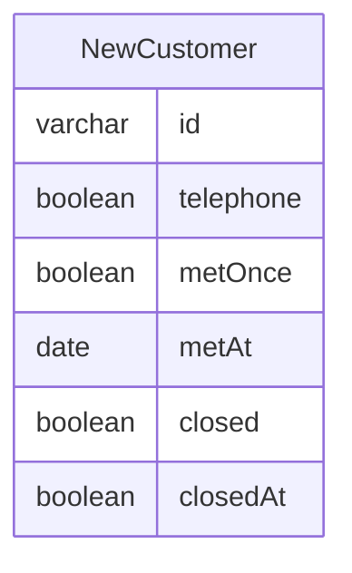
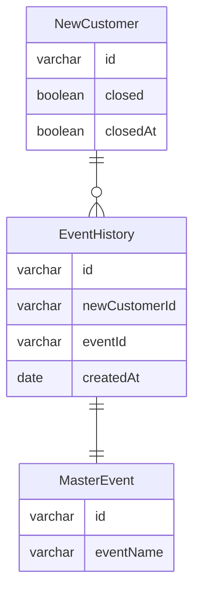

## 問 1

- ある顧客に対する複数の電話営業結果が管理できない
  - NewCustomer の ID には１営業活動ごとに ID が振られるはずなので
  - NewCustomer の ID は、本当に顧客 ID を指しているのか？営業イベントの識別 ID なのか？
    - 単純にテーブル名がよくない気がする
- ある顧客に対する電話営業を何回行ったかの集計もできない
- 電話をかけたかどうかと実際にアポを取れたかの管理が同じテーブルに存在してしまっている
  - 片方のみの場合もありうるはずで、その場合余計な null が保存されることになる
- 制約したかどうか、以外のステータスが管理できない

## 問 2

- 以下修正例

