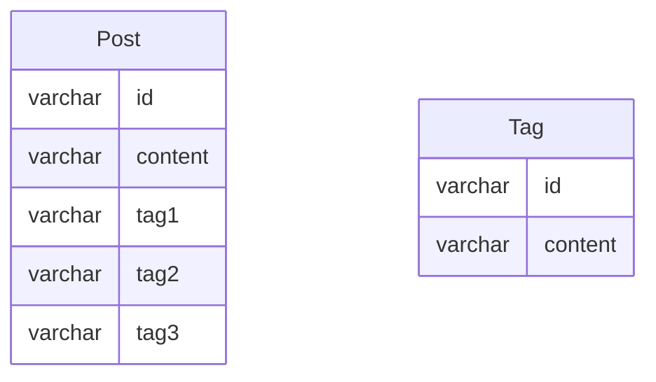
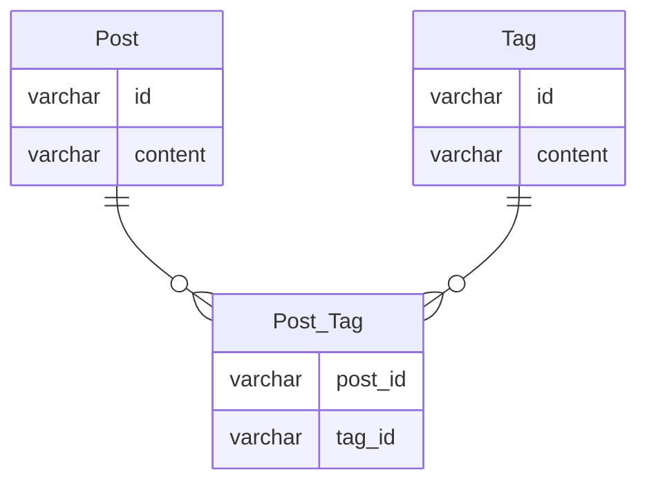

## 問 1

- 俗に言う[マルチカラムアトリビュート]のアンチパターン
- 具体的な問題は以下が考えられる

  - ある Tag を持つ Post を検索する際に、テーブルが持つ tag 系カラムの数だけ where 条件に含める必要が出てしまう
  - Post に新たにタグを追加したい場合、その都度 tag4, tag5・・とカラムが増えてしまう
  - 各種 tag 系カラムの中に入る値が unique であることを保証できない
  - カラムの更新をする際に、全てのカラムの値のチェックから行う必要がある

## 問 2

- 以下修正例

- Post_Tag テーブルの post_id と tag_id で複合 unique 制約をつけることにより、 
  「ある Post が持つタグの属性が一意になること」も保証可能(= 1 つの Post が同じタグを持ってしまうことがない)
